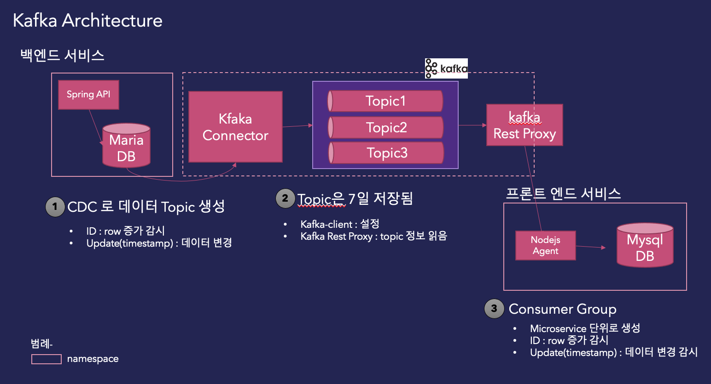

# 개요   
kafka connector를 이용하여 mariadb cdc를 구현하는 방법을 소개합니다. 


# 설치
- kafka
- kafka-connector
- kafka-client
- kafka-rest-proxy
- mariadb
- mysqldb

# sample application
- [api server : springboot로 개발](https://github.com/devJacob01/mvp-sample-springboot)
- [sync agent : nodejs 로 개발](https://github.com/devJacob01/nodejs-mysql-agent)   


# hands-on


## 설치하기

### 1. kafka 설치 
[confluent](https://github.com/confluentinc/cp-helm-charts) 에서 제공하는 helm 챠트를 다운로드 받는다.
```
git clone git@github.com:confluentinc/cp-helm-charts.git
```
다운로드 받은 디렉토리로 이동한다.
```
cd cp-helm-charts
```
디렉토리 리스트를 출력하면 아래와 같은 목록이 나온다.   
```
charts      docs      grafana-dashboard  LICENSE      requirements.yaml  scripts    values.yaml
Chart.yaml  examples  Jenkinsfile        README.adoc  screenshots        templates

```
설치하고자 하는 namespace를 변경하고 helm설치 명령을 실행한다.

```
helm install confluent \
    --namespace lab99 \
    ./charts/cp-kafka
```
설치된 pod를 확인한다.
```
kubectl get pod 
```
```
confluent-cp-kafka-0                            2/2     Running             1          39h
confluent-cp-kafka-1                            2/2     Running             1          39h
confluent-cp-kafka-2                            2/2     Running             0          39h
confluent-cp-zookeeper-0                        2/2     Running             0          39h
confluent-cp-zookeeper-1                        2/2     Running             0          39h
confluent-cp-zookeeper-2                        2/2     Running             0          39h
```
서비스 정보도 확인한다.
```
kubectl get service
```
```
confluent-cp-kafka                ClusterIP   10.96.49.17      <none>        9092/TCP,5556/TCP               39h
confluent-cp-kafka-headless       ClusterIP   None             <none>        9092/TCP                        39h
confluent-cp-zookeeper            ClusterIP   10.105.211.249   <none>        2181/TCP,5556/TCP               39h
confluent-cp-zookeeper-headless   ClusterIP   None             <none>        2888/TCP,3888/TCP               39h
```

### 2. kafka connector 설치 
kafka connector는 mariadb에서 cdc 연계를 하기 위한 모듈이다.   
설치 스크립트를 실행한다.
```
helm install confluent-2 \
  --set image="nextgencloud/kafka-connect" \
  --set imageTag="5.4.0-jdbc" \
  --set kafka.bootstrapServers="PLAINTEXT://confluent-cp-kafka-headless:9092" \
  ./charts/cp-kafka-connect
```
설치된 프로그램을 삭제하기 위해서는 삭제 명령을 수행한다.
```
helm delete confluent-2
```

### 3. kafka rest proxy 설치
kafka rest proxy는 topic에 등록된 메시지를 rest api를 통해서 조작하도록 기능을 제공하는 모듈이다. consumergroup을 등록하고 subscribe 설정 및 데이터를 읽는 작업을 수행할 수 있다. 
```
helm install cp-kafka-rest \
  --set cp-kafka.bootstrapServers="PLAINTEXT://confluent-cp-kafka-headless:9092" \
  --namespace lab99 \
  ./charts/cp-kafka-rest
```
설치된 프로그램을 삭제하기 위해서는 삭제 명령을 수행한다.
```
helm delete cp-kafka-rest
```
외부에서 서비스를 접속하기 위해서는 NodePort 설정을 해 주어야 한다.
콘솔에서 서비스 정보를 확인한다.


```
cp-kafka-rest                     NodePort    10.104.33.80     <none>        8082/TCP  47h
```
kubectl edit 명령으로 서비스 리소스 정보를 수정한다.
```
kubectl edit svc cp-kafka-rest
```
type 을 ```NodePort```로 변경하고 정보를 저장한다.   
```
# reopened with the relevant failures.
#
apiVersion: v1
kind: Service
metadata:
  creationTimestamp: "2021-04-07T07:35:42Z"
  labels:
    app: cp-kafka-rest
    chart: cp-kafka-rest-0.1.0
    heritage: Helm
    release: cp-kafka-rest
  name: cp-kafka-rest
  namespace: lab99
  resourceVersion: "4419084"

  ...

  type: NodePort
status:
  loadBalancer: {}
```
NodePort가 추가된 것을 확인할 수 있다.
```
cp-kafka-rest                     NodePort    10.104.33.80     <none>        8082:30432/TCP,5556:30985/TCP   47h
```

### 4. kafka-client 설치 
kafka-client는 kafka에 topic을 생성하거나 설정 정보를 변경할때 사용하는 프로그램이다.   

yaml 파일을 생성한다. kafka-client.yaml파일을 만들어서 아래 내용을 입력한다.  
namespace 정보를 수정한다.  
```
apiVersion: v1
kind: Pod
metadata:
  name: kafka-client
  namespace: lab99
spec:
  containers:
    - name: kafka-client
      image: confluentinc/cp-enterprise-kafka:5.4.1
      command:
        - sh
        - -c
        - "exec tail -f /dev/null"
```

pod를 생성하기 위해 파일을 생성한 위치에서 다음 명령을 수행한다.   
```
kubenctl apply -f kafka-client.yaml
```


### 5. mariadb 설치하기 
mariadb를 설치하기 위해 helm챠트를 이용할 수 있다. 다만, 설정을 위한 configmap.yaml에 있는 내용은 반드시 추가 되어야 한다.    
여기서는 yaml을 이용하여 설치하는 방법으로 진행하겠다.   
설치를 위해서 필요한 리소스는 다음과 같다.   
- pv.yaml
- pvc.yaml
- service.yaml
- deployment.yaml
- configmap.yaml

pv.yaml 을 생성한다.   
namespace를 수정한다.   
```
apiVersion: v1
kind: PersistentVolume
metadata:
  name: lab99-mariadb-pv # modify
  labels:
    type: mariadb
spec:
  storageClassName: mariadb
  accessModes:
    - ReadWriteOnce
  capacity:
    storage: 10Gi
  hostPath:
    path: "/data/mariadb"
```
kubectl 명령을 통해 리소스를 생성한다.
```
kubectl apply -f pv.yaml
```
pvc.ymal을 생성한다.   
namespace를 수정한다. 
```
apiVersion: v1
kind: PersistentVolumeClaim
metadata:
  name: lab99-mariadb-pvc # modify
  labels:
    type: mariadb
spec:
  storageClassName: mariadb
  accessModes:
    - ReadWriteOnce
  resources:
    requests:
      storage: 10Gi
```
kubectl 명령을 통해 리소스를 생성한다.
```
kubectl apply -f pv.yaml
```

service.yaml 파일을 생성합니다.  
외부에서 접속을 위해 type을 NodePort로 생성합니다.   


```
apiVersion: v1
kind: Service
metadata:
  name: private-mariadb
  labels:
    name: mariadb
spec:
  type: NodePort
  ports:
    - port: 3306
  selector:
    name: private-mariadb
    tier: mariadb
```

deployment.yaml를 생성한다.   

```
apiVersion: apps/v1
kind: Deployment
metadata:
  name: private-mariadb
spec:
  selector:
    matchLabels:
      name: private-mariadb
  strategy:
    type: Recreate
  template:
    metadata:
      labels:
        name: private-mariadb
        tier: mariadb
    spec:
      containers:
        - image: mariadb:latest
          name: mariadb
          env:
            - name: MYSQL_ROOT_PASSWORD
              value: "passw0rd"
          ports:
            - containerPort: 3306
          volumeMounts:
            - name: private-mariadb-pv
              mountPath: /var/lib/mariadb
            - name: config
              mountPath: /etc/mysql
              readOnly: true
      volumes:
        - name: private-mariadb-pv
          persistentVolumeClaim:
            claimName: lab99-mariadb-pvc
        - name: config
          configMap:
            name: mariadb-config
```
configmap.yaml을 생성한다.   
kafka-connector랑 연동하기 위해서는 log-bin 설정이 되어야 한다. 
bin log의 유효기간 7일은 목적에 따라 적절한 값으로 변경하면 된다.    
```
apiVersion: v1
kind: ConfigMap
metadata:
  name: mariadb-config
data:
  my.cnf: |
    [mysqld]
    lower_case_table_names=1
    skip_ssl
    log-bin=/var/lib/mysql/bin.log
    binlog_cache_size=2M
    max_binlog_size=512M
    expire_logs_days=7
```

## 설정하기
mariadb에서 값이 변경된 것을 kafka topic으로 연계하기 위해서는 kakfa-connector를 설정해 주어야 한다.  
다음과 같은 순서로 진행한다. 

1. database, table 생성
2. kafka-connector 생성 

### 1. database, table 생성  
database 및 계정을 생성한다.
생성된 계정에 권한을 할당한다.  
```
create database msadb default CHARACTER SET utf8 collate utf8_unicode_ci;
create user 'msa'@'%' IDENTIFIED by 'passw0rd';
grant all PRIVILEGES on msadb.* to 'msa'@'%';
```
sample 테이블을 생성한다.  
데이타가 추가된 것을 감지하기 위한 ```id``` 항목과 데이터 변경된 데이터를 인지하기 위한 ```updated``` 컬럼은 반드시 필요하다.  
```
CREATE TABLE `tb_user` (
  `id` int(11) unsigned NOT NULL AUTO_INCREMENT,
  `user_id` varchar(50) COLLATE utf8_unicode_ci DEFAULT NULL,
  `user_nm` varchar(250) COLLATE utf8_unicode_ci DEFAULT NULL,
  `addr` varchar(500) COLLATE utf8_unicode_ci DEFAULT NULL,
  `cell_phone` varchar(250) COLLATE utf8_unicode_ci DEFAULT NULL,
  `agree_info` varchar(50) COLLATE utf8_unicode_ci DEFAULT NULL,
  `birth_dt` varchar(50) COLLATE utf8_unicode_ci DEFAULT NULL,
  `updated` timestamp default CURRENT_TIMESTAMP NOT NULL
  PRIMARY KEY (`id`),
  `idx_tb_user_updated` on tb_user(`updated`);
) ENGINE=InnoDB AUTO_INCREMENT=4 DEFAULT CHARSET=utf8 COLLATE=utf8_unicode_ci
```
### 2. kafka-connector 생성
 

connection을 생성하기 위해서는 kafka-connector pod 안에서 명령을 수행해야 한다.  
kubectl get pod로 설치된 pod명을 확인하다. 
```
NAME                                            READY   STATUS              RESTARTS   AGE
confluent-2-cp-kafka-connect-67c75f65c6-qw76f   2/2     Running             0          4d11h
```
등록된 pod명을 넣고 다음 명령을 수행한다. pod명만 확인된 값으로 수정하고 실행하자.
```
kubectl exec -ti confluent-2-cp-kafka-connect-67c75f65c6-qw76f \
  --container cp-kafka-connect-server -- /bin/bash
```
pod 안에서 다음 명령을 수행하여 connector를 등록한다.   

```name```의 경우 생성하고자 하는 connector의 이름이다.   
```connection.url```에 생성한 database 정보를 입력한다.  
```mode```의 경우 데이터의 생성/변경 등의 설정값을 세팅할 수 있다. 현재는 신규와 변경 2 정보에 대해 변화를 감지하도록 설정하였다.    
```incrementing.column.name```의 경우 row가 증가할 경우 확인할 컬럼을 넣는다. 여기서는 'id'값으로 한다.
```timestamp.column.name```의 경우  데이터의 변경이 생기는 컬럼 항목을 넣는다. 여기서는 'updated' 컬럼으로 지정하였다.   
```topic-prefix```의 경우 kafka topic이 생성될 때 접두어로 사용될 값을 입력한다.  

```
curl -X POST \
  -H "Content-Type: application/json" \
  --data '{ "name": "k8s-connect-source",
  "config": {
  "connector.class":"io.confluent.connect.jdbc.JdbcSourceConnector",
  "key.converter": "org.apache.kafka.connect.json.JsonConverter",
  "value.converter": "org.apache.kafka.connect.json.JsonConverter",
  "key.converter.schemas.enable": "false",
  "value.converter.schemas.enable": "false",
  "tasks.max": 1,
  "connection.url":"jdbc:mysql://169.56.84.35:31778/msadb?user=msa&password=passw0rd",
  "mode": "timestamp+incrementing",
  "incrementing.column.name": "id",
  "timestamp.column.name": "updated",
  "topic.prefix": "k8s-connect-",
  "poll.interval.ms": 1000 } }'\
  http://localhost:8083/connectors

```
생성된 connector를 확인한다. 여기서는 k8s-connect-source로 생성 하였으므로 이 값을 넣고 상태를 조회한다.  
```
curl -s -X \
  GET http://localhost:8083/connectors/k8s-connect-source/status
```
상태가 'RUNNING' 이어야 정상적으로 동작한다.  
```json
{"name":"k8s-connect-source","connector":{"state":"RUNNING","worker_id":"192.168.229.190:8083"},"tasks":[{"id":0,"state":"RUNNING","worker_id":"192.168.229.190:8083"}],"type":"source"}
```
잘못 생성된 경우는 삭제한다.  

```
curl -X DELETE localhost:8083/connectors/k8s-connect-source

```

## topic 생성하기   

kafka-client를 통해서 topic을 생성한다.   

생성된 topic list를 확인한다. 
```
kubectl -n lab99 exec kafka-client -- /usr/bin/kafka-topics --zookeeper confluent-cp-zookeeper:2181 --list
```
아래와 같은 목록이 출력된다.   
```
__consumer_offsets
_confluent-metrics
confluent-2-cp-kafka-connect-config
confluent-2-cp-kafka-connect-offset
confluent-2-cp-kafka-connect-status
```
확인하고자 하는 t 명을 선택하여 아래 명령을 수정하고 실행한다.
```
kubectl -n lab99 exec kafka-client -- /usr/bin/kafka-topics --zookeeper confluent-cp-zookeeper:2181 --list
```

tb_user테이블이 k8s-connect-tb_user라 명으로 새로운 topic이 생성 되었다.   
```
__consumer_offsets
_confluent-metrics
confluent-2-cp-kafka-connect-config
confluent-2-cp-kafka-connect-offset
confluent-2-cp-kafka-connect-status
k8s-connect-tb_user
```

생성된 토픽에 대해 메시지를 확인하기 위한 명령이다. 위에서 생성된 토픽명을 인자값으로 수정하여 다음 명령을 수행한다.  
```
kubectl -n lab99 exec -ti \
    kafka-client -- /usr/bin/kafka-console-consumer \
    --bootstrap-server confluent-cp-kafka-headless:9092 \
    --topic k8s-connect-user05-tb_user --from-beginning
```

table에 값이 입력되면 데이터가 자동으로 topic에 전달되고 topic에 저장된 항목이 콘솔애 출력된다. 
```json
{"id":15,"user_id":"han3","user_nm":"test","addr":"dd","cell_phone":"0102223333","agree_info":"aa","birth_dt":"dd","updated":1617858547000}
```

## consumer group 관리하기  
topic으로 부터 데아터를 읽기 위해서는 해당 topic을 consumer gruop으로 등록해야 한다. 
### 1. consumer group 등록
```kubectl get svc```에서 NodePort 정보를 확인한다.
```
NAME                              TYPE        CLUSTER-IP       EXTERNAL-IP   PORT(S)                         AGE
cp-kafka-rest                     NodePort    10.104.33.80     <none>        8082:30432/TCP,5556:30985/TCP   4d21h
```
```kubectl get node -o wide``` 로 cluster 고정IP 정보를 확인한다.
보통 external IP인데, 여기서는 internal-ip가 외부에서 접속 가능한 고정 IP로 등록이 되었다. 클러스터 마다 정보가 다르므로 이를 확인한다.  
```
NAME                STATUS   ROLES                  AGE    VERSION   INTERNAL-IP     EXTERNAL-IP   OS-IMAGE         KERNEL-VERSION                 CONTAINER-RUNTIME
k8s2.msa.ibm.com   Ready    control-plane,master   20d    v1.20.5   169.56.84.35    <none>        CentOS Linux 8   4.18.0-193.14.2.el8_2.x86_64   docker://20.10.5
```
외부 접속 IP와 Port정보를 확인 하였으면 이 정보로 다음의 명령을 수행한다.   
로컬 PC 또는 명령을 수행하는 PC에 curl이 설치되어 있어야 한다.  
```name```에는 등록할 컨슈머 그룹 인스턴스명을 적는다. 
등록할 ```url``` 정보에 컨슈머 그룹을 적는다. 여기서는 cg-tb_user-01로 명명 하였다. 
```
curl -X POST -H "Content-Type: application/vnd.kafka.v2+json" \
      --data '{"name": "cg-tb_user-01-instance", "format": "json", "auto.offset.reset": "earliest"}' \
      http://169.56.84.35:30432/consumers/cg-tb_user-01 
```
처리 결과 다음과 같은 json 결과값을 리턴 받는다. 등록된 인스턴스 아이디와 base_url 정보를 확인할 수 있다. 
```json
{"instance_id":"cg-tb_user-01-instance","base_uri":"http://192.168.42.122:8082/consumers/cg-tb_user-01/instances/cg-tb_user-01-instance"}
```
### 2. consumer 구독하기
1번에서 등록한 consumer group의 결과로 리턴받은 base_url을 이용하여 topic구독을 설정한다.  
~/consumners/ 다음 항목으로 사용할 url은 리턴받은 base_url값을 적어준다.
구독하고 싶은 topic을 topics 항목에 기입힌다.   
```
주의) 
리턴 받은 base_url의 경우 내부IP(Private IP)를 사용한 주소이므로 위에서 확인한 내부접속 가능한 정보를 사용하여야 한다.
```

```
curl -X POST -H "Content-Type: application/vnd.kafka.v2+json" --data '{"topics":["k8s-connect-tb_user"]}' \
http://169.56.84.35:30432/consumers/cg-tb_user-01/instances/cg-tb_user-01-instance/subscription
```

### 3. topic으로 부터 data 가져오기 
구독하기까지 설정을 완료 하였으면 데이터를 읽어올수 있다. 
다음의 명령을 수행하여 topic에 있는 값을 읽어 올 수 있다.
```
curl -X GET -H "Accept: application/vnd.kafka.json.v2+json" \
      http://169.56.84.35:30432/consumers/cg-tb_user-01/instances/cg-tb_user-01-instance/records 
```
```json
[{"topic":"k8s-connect-tb_user","key":null,"value":{"id":13,"user_id":"han1","user_nm":"테스트","addr":"dd","cell_phone":"aaa","agree_info":"aa","birth_dt":"dd","updated":1617856496000},"partition":0,"offset":9}]
```

### 4. consumer group 삭제하기 
등록된 정보를 삭제(초기화)하는 명령이다.
```
curl -X DELETE http://169.56.84.35:30432/consumers/cg-tb_user-01/instances/cg-tb_user-01-instance
```
   
      
## 결언     

지금까지 kafka-connector와 kafka-rest-proxy를 통해 data를 연계하는 방법을 알아 보았다.  kafka-connector 는 database에서 데이터 변경시 손쉽게 kafka topic으로 메시지를 보낼 수 있는 매우 강력한 연계 모듈이다.  connector 설정을 통해 다양한 data source로 부터 손쉽게 topic에 데이터를 연계할 수 있다.   
보다 상세한 내용은 [confluent-connector](https://docs.confluent.io/home/connect/overview.html) 사이트를 통해 알아보자.  

## [참고] 유용한 명령 모음   
위에 설치한 모듈에서 사용되는 여러가지 유용한 명령어에 대하여 몇가지 예제를 설명하겠다.
### kafka-connector
#### connector log
kakfa-connector의 로그를 통해  connector가 잘 동작하는지 모니터링을 할 수 있다.  로그를 확인하기 위해서는 구동하는  pod정보를 먼저 확인해야 한다.  
```kubectl get pod ```명령을 통해 실행되는 pod 정보를 확인하자.
```
NAME                                            READY   STATUS              RESTARTS   AGE
confluent-2-cp-kafka-connect-67c75f65c6-qw76f   2/2     Running             0          4d15h
```
pod내에 특정 컨테이너를 지정해야 로그 정보를 확인할 수 있다.  cp-kafka-connect-server 컨테이너를 선택해서 로그를 확인하는 명령이다.
```
kubectl logs -f confluent-2-cp-kafka-connect-67c75f65c6-qw76f  \
--container cp-kafka-connect-server
```
로그가 출력된다.
```
[2021-04-12 05:51:09,176] INFO WorkerSourceTask{id=k8s-connect-source-user05-0} flushing 0 outstanding messages for offset commit (org.apache.kafka.connect.runtime.WorkerSourceTask)
[2021-04-12 05:51:09,176] INFO WorkerSourceTask{id=k8s-connect-source-0} Committing offsets (org.apache.kafka.connect.runtime.WorkerSourceTask)
[2021-04-12 05:51:09,176] INFO WorkerSourceTask{id=k8s-connect-source-0} flushing 0 outstanding messages for offset commit (org.apache.kafka.connect.runtime.WorkerSourceTask)

```
#### sink connector 생성
kafka topic으로 부터 읽어 들인 데이터를 타켓 디비에 전송하기 위해 제공되는 커넥터이다. 생성은 connector-source를 생성하는 방식과 동일하다. kafka-connecotr pod안에서 다음의 명령을 수행하면 된다.  
디비 접속과 몇가지 옵션을 조정하고 실행해 보자.  
```
curl -X POST \
  -H "Content-Type: application/json" \
  --data '{ "name": "k8s-connect-sink",
  "config": {
    "connector.class":"io.confluent.connect.jdbc.JdbcSinkConnector",
    "connection.url":"jdbc:mysql://169.56.84.35:31431/msadb",
    "connection.user": "msa",
    "connection.password": "passw0rd",
    "db.name": "msadb",
    "poll.interval.ms": "3600",
    "table.poll.interval.ms": "5000",
    "tasks.max":"3",
    "topics.regex": "^k8s-connect-(.*)",
    "insert.mode": "UPSERT",
    "auto.create": "true",
    "auto.evolve": "true",
    "schemas.enable" : "true",
    "errors.tolerance": "all",
    "errors.log.enable": true,
    "errors.log.include.messages": true } }'\
  http://localhost:8083/connectors
```

### kafka-client
#### topic listen
등록한 topic의 전달된 메세지 목록을 보기 위한 명령이다. 
topic명을 위에서 생성한 topic으로 수정하고 아래 명령을 수행한다.
```
kubectl -n lab99 exec -ti \
    kafka-client -- /usr/bin/kafka-console-consumer \
    --bootstrap-server confluent-cp-kafka-headless:9092 \
    --topic k8s-connect-tb_user --from-beginning
```
topic에 등록된 데이터 리스트가 보여진다. 
```json
{"id":15,"user_id":"han3","user_nm":"test","addr":"dd","cell_phone":"0102223333","agree_info":"aa","birth_dt":"dd","updated":1617858547000}
```

#### consumer group list
등록된 컨슈머 그룹 목록을 확인한다. 
```
kubectl -n lab99 exec -ti \
    kafka-client -- /usr/bin/kafka-consumer-groups \
    --bootstrap-server confluent-cp-kafka-headless:9092 \
    --list
```

```
console-consumer-39205
cg-tb_user-01
```


#### consumer group offset 초기화 
오프셋을 초기화 한다.

```
kubectl -n lab99 exec -ti \
    kafka-client -- /usr/bin/kafka-consumer-groups \
    --bootstrap-server confluent-cp-kafka-headless:9092 \
    --group cg-tb_user-01 \
    --reset-offsets \
    --all-topics \
    --to-earliest \
    --execute
```
오프셋 정보가 0으로 초기화 되었다.
```
GROUP                          TOPIC                          PARTITION  NEW-OFFSET     
cg-tb_user-01                  k8s-connect-tb_user            0          0     
```

topic으로 부터 데이터를 읽으면 다시 처음부터 데이터를 읽어 들일 수 있다.
```
curl -X GET -H "Accept: application/vnd.kafka.json.v2+json" \
      http://169.56.84.35:30432/consumers/cg-tb_user-01/instances/cg-tb_user-01-instance/records 
```

```json
[{"topic":"k8s-connect-tb_user","key":null,"value":{"id":13,"user_id":"han1","user_nm":"테스트","addr":"dd","cell_phone":"aaa","agree_info":"aa","birth_dt":"dd","updated":1617856496000},"partition":0,"offset":9}]
```

### kafka-rest-proxy
rest-proxy의 경우 설치된 클러스터에 고정 IP와 nodeport가 설정되어 있어야 한다.(위에서 설명)   
클러스터 정보와 오픈된 Nodeport확인하고 아래 명령을 수행하면 결과값을 확인할 수 있다.
```
curl -X GET "http://169.56.84.35:30432/topics/"
curl -X GET "http://169.56.84.35:30432/topics/k8s-connect-tb_user"
curl -X GET "http://169.56.84.35:30432/v3/clusters/"
```